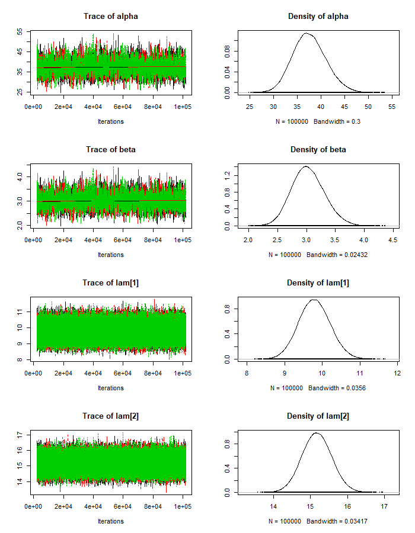
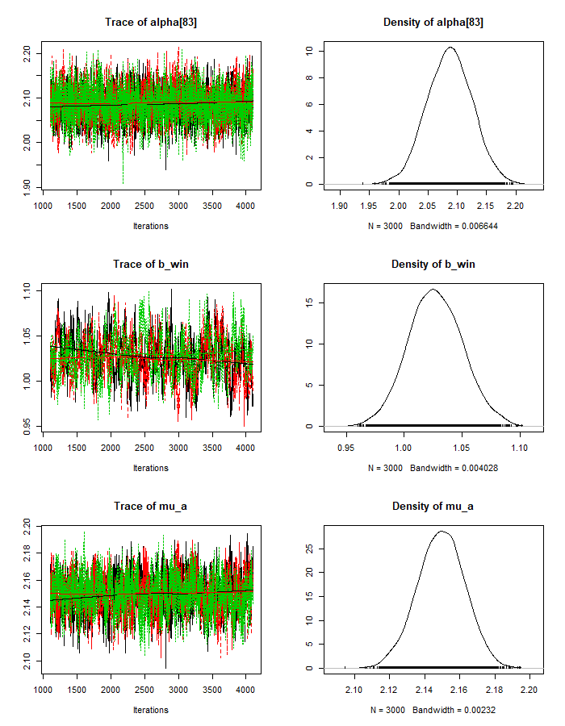
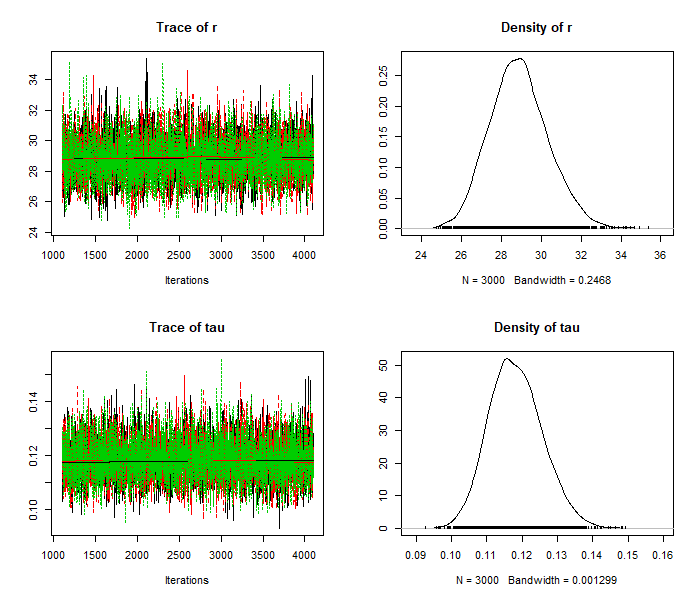

##Introduction
In this analysis I model pro soccer team shots using three different Bayesian hierarchical models:

- A simple hierarchical Poisson model
- A Poisson regression with a random intercept
- A negative binomial regression with a random intercept

I explore real game data which comes from [Kaggle](https://www.kaggle.com/secareanualin/football-events). It has been built by integrating different data sources and has been organized into two files:

- `events.csv` contains event data about European soccer games, including shot attempts
- `games.csv` contains metadata and market odds about each game

##Data Exploration

```{r message=FALSE, warning=FALSE}
library(readr)
library(gridExtra)
library(dplyr)
library(rjags)
library(ggplot2)

options(knitr.table.format = "html")
theme_set(theme_classic())

events <- read_csv("data/events.csv", progress = FALSE)
games <- read_csv("data/ginf.csv", col_types = cols(date = col_date(format = "%Y-%m-%d")), progress = FALSE)
```

Before modeling the shots, we can foresee a couple of problems with aggregating team and game data in this data set. If we are interested in shots per game per team and simply add up shots, there are two issues when we model the counts:

1. Games are different lengths due to overtime and delays. To work around this we will just model shots per 90 minutes of game play (the length of a regular game).

2. If we use every game in this data set for our sample, they will not be independent, since every game's shot count will be directly dependent on one other shot count (the opposing team for that game). If one team has ball possession, the other team doesn't- and so if one team is shooting a lot, the other team probably isn't shooting as much. To solve this, we can select half of our samples by randomly choosing one team's shots for each game.

Shot attempts are shown in the data as event type 1. We'll create an integer team_id, as well as a team_game id which is the game_id and team_id concatenated. We'll use `team_game` to group and `game_id` to sample. We'll also create a column for the team's odds, which will come from either the `odd_h` or `odd_a` columns, depending on if the sampled team was home or away.

```{r}
attempts <- events[events$event_type==1,]
attempts$team_id <- as.integer(as.factor(attempts$event_team))
attempts$team_game <- do.call(paste, c(attempts[c("id_odsp", "team_id")], sep = " ")) 

game_time_ranges <- attempts %>% group_by(id_odsp) %>% summarise(time = max(time))
games <- merge(games, game_time_ranges, by = "id_odsp", all.x = TRUE)


attempts_by_team <- attempts %>% group_by(team_game, id_odsp, event_team, team_id) %>% summarise(attempts = n())
s_team_attempts <- attempts_by_team %>% group_by(id_odsp) %>% sample_n(1)
s_team_attempts <- merge(s_team_attempts, games, all.x = TRUE)

s_team_attempts$attempts_per_minute <- s_team_attempts$attempts/s_team_attempts$time
s_team_attempts$attempts_per_game <- round(s_team_attempts$attempts_per_minute * 90, digits = 0)

s_team_attempts$team_odds <- ifelse(s_team_attempts$event_team == s_team_attempts$ht,
                                    s_team_attempts$odd_h,
                                    s_team_attempts$odd_a)

```

Let's look at the distribution of shots per (90 min) game. At first glance, the data looks like it could be a Poisson distribution- although note that the variance is larger than the mean. Poisson variables have mean equal to variance, so this indicates over-dispersion in our data. We'll proceed with Poisson anyway and see if the over-dispersion can be handled within the model.

```{r}
g <- ggplot(s_team_attempts, aes(attempts_per_game))
g + geom_bar() + 
  #geom_density(aes()) +
  labs(title="All games, team shot totals", 
       subtitle=paste("Overall mean = "
                      ,round(mean(s_team_attempts$attempts_per_game))
                      ,"\nOverall variance = "
                      ,round(var(s_team_attempts$attempts_per_game))),
       #caption="Source:",
       x="Shots",
       y="# Games")
```

Now let's look at the shots aggregated by team. The team averages vary, but we can also see that our sample sizes by team are all over the place. Teams with higher sample sizes also appear to make more shots per game. This might be because the better teams make more shots, and as a result get to play more games? A hierarchical model will take advantage of both differences in mean shots and sample sizes, as we will see.

```{r}
team_stats <- s_team_attempts %>% group_by(team_id) %>% summarise(median_attempts = median(attempts_per_game),
                                                                  mean_attempts = mean(attempts_per_game),
                                                                  n_games = n())


ggplot(team_stats, aes(reorder(team_id, n_games), n_games, colour=median_attempts)) +
  geom_point(size=2, alpha=.5) + 
  scale_colour_gradient(high = "blue", low="gray90") +
  #geom_density(aes()) +
  labs(title="Sample size by team", 
       subtitle="Dots represent teams",
       #caption="Source:",
       x="Teams (sorted)",
       y="Sample size (# Games)") +
  theme(axis.text.y=element_blank(),
        axis.ticks.y=element_blank()) +
coord_flip()
```

```{r}
ggplot(team_stats, aes(mean_attempts)) +
  geom_histogram(binwidth = 0.4) + 
  #geom_density(aes()) +
  scale_x_continuous(limits = c(0, 20)) +
  labs(title="Distribution of team mean shots per-game", 
       subtitle=paste("Overall mean = "
                      ,round(mean(team_stats$mean_attempts))
                      ,"\nOverall variance = "
                      ,round(var(team_stats$mean_attempts))),
       #caption="Source:",
       x="Mean shot attempts",
       y="# Teams")

```


##Simple Hierarchical Model

Our first model is a simple hierarchical model where our $n=9,074$ independent shot counts come from $k=142$ teams, each of which has it's own mean, $\lambda_{t}$.

$$y_{i}\mid t_{i}, \lambda_{t_{i}} \overset{\mathrm{ind.}}{\sim} \mathit{Poisson}(\lambda_{t_{i}}) \\t\in \left \{ 1,...,k \right \}\\ i=1,..,n$$

The team means will come from a common gamma distribution:

$$\lambda_{i} \overset{\mathrm{i.i.d.}}{\sim} \mathit{Gamma}(\alpha, \beta)$$

with priors for the hyper-parameters also following gammas:

$$\alpha \sim \mathit{Gamma}(30, 1) \\ \beta \sim \mathit{Gamma}(20, 10)$$
Setting up the model hierarchically allows us respect the fact that different teams will have different average shot counts, without making a separate model for every team. The structure utilizes all of the shot data, but a given team's expected shots will depend on it's own data more than other teams' data. If a team doesn't have as much historical data, it will rely more on the overall average.

I've chosen relatively weak priors, since I don't have strong beliefs about the exact distribution of team averages. I know that our data is comprehensive and representative of European soccer as a whole, but I have very little background knowledge about the sport or leagues. I think that it should be unlikely for a team's average to be much lower than our data's minimum of 9, since the team would simply not be scoring enough to win, and be forced to make changes. I suspect that team averages could be substantially higher than our data's maximum of 18.5, since some teams could probably choose a more aggressive strategy with respect to shot attempts.

We can visualize our prior predictive distribution by simulating draws from the hyper-parameters, $\alpha$ and $\beta$, and then proceeding down the hierarchy.

First let's plot the hyper-parameter distributions and visualize the prior distributions. $\alpha$/$\beta$ (the mean of a gamma distribution) is the overall team mean score. 

```{r warning=FALSE}
alpha_pri_shape <- 30
alpha_pri_rate <- 1

beta_pri_shape <- 20
beta_pri_rate <-  10

alpha_plot <- ggplot(data.frame(theta = seq(0,50)), aes(x=theta)) +
  stat_function(fun = dgamma, args=list(shape=alpha_pri_shape, rate=alpha_pri_rate), alpha=.85) +
  geom_vline(xintercept = alpha_pri_shape/alpha_pri_rate, linetype="dashed", size=.5) +
  labs(title=expression(paste(alpha, " prior")), 
       subtitle=paste("Mean = ",alpha_pri_shape/alpha_pri_rate),
       #caption="Source:",
       x=expression(theta),
       y=expression(paste("Pr(",theta,")")))


beta_plot <- ggplot(data.frame(theta = seq(0,5)), aes(x=theta)) +
  stat_function(fun = dgamma, args=list(shape=beta_pri_shape, rate=beta_pri_rate), alpha=.85) +
  geom_vline(xintercept = beta_pri_shape/beta_pri_rate, linetype="dashed", size=.5) +
  labs(title=expression(paste(beta, " prior")), 
       subtitle=paste("Mean = ",beta_pri_shape/beta_pri_rate),
       #caption="Source:",
       x=expression(theta),
       y=expression(paste("Pr(",theta,")")))

set.seed(315)
n_sim = 10000
alpha_pri = rgamma(n_sim,alpha_pri_shape,alpha_pri_rate)
beta_pri = rgamma(n_sim,beta_pri_shape,beta_pri_rate)
mu_pri = alpha_pri/beta_pri
#sig_pri = sqrt(alpha_pri/beta_pri^2)
lambda_plot <- ggplot(data.frame(mu_pri), aes(mu_pri), alpha=.85) +
  geom_density(aes(y=..density..)) +
  geom_vline(xintercept = mean(mu_pri), linetype="dashed", size=.5) +
  labs(title=expression(paste(lambda, " prior")), 
       subtitle=paste("Mean = ",round(mean(mu_pri),digits = 1)),
       #caption="Source:",
       x="Mean shot attempts",
       y="# Teams") +
  scale_x_continuous(limits = c(0, 40))

lay <- rbind(c(1,1,2,2),
             c(NA,3,3,NA))

grid.arrange(alpha_plot, beta_plot, lambda_plot, layout_matrix=lay)

```

We can then sample from $\lambda$ to generate our data from our priors. Our data has 142 teams with different numbers of games. We will simplify and generate a balanced data set of 142 teams with 64 games each.

```{r warning=FALSE}
lam_pri = rgamma(n=142, shape=alpha_pri[1:142], rate=beta_pri[1:142])
y_pri = rpois(n=9074, lambda=rep(lam_pri, each=64))
g <- ggplot(data.frame(y_pri), aes(y_pri))
g + geom_histogram(aes(y=..density..), binwidth=1) +
  labs(title="Shot Attempts", 
       subtitle="Prior predictive distribution",
       #caption="Source:",
       x="# Shot Attempts",
       y="# Games") +
  scale_x_continuous(limits = c(0, 40))
```

This is a reconstruction of our data set, based only on the priors, re balanced by team. we'll now use JAGS to define our model in R and perform the MCMC sampling.

```{r warning=FALSE, message=FALSE, eval=TRUE, cache=TRUE}
mod_string = " model {
for (i in 1:length(attempts_per_game)) {
  attempts_per_game[i] ~ dpois(lam[team_id[i]])
}

for (t in 1:max(team_id)) {
  lam[t] ~ dgamma(alpha, beta)
}

alpha ~ dgamma(30, 1)
beta ~ dgamma(20, 10)

} "

data_jags = as.list(s_team_attempts)

params = c("lam", "alpha", "beta")

mod_1 = jags.model(textConnection(mod_string), data=data_jags, n.chains=3, quiet=TRUE)
update(mod_1, 1e3, progress.bar="none")

mod_sim_1 = coda.samples(model=mod_1,
                       variable.names=params,
                       n.iter=1e5,
                       progress.bar="none")
                       
mod_csim_1 = as.mcmc(do.call(rbind, mod_sim_1))
```

JAGS allows us to create trace plots for the Markov chains to visually assess convergence:

```{r eval=FALSE}
plot(mod_sim_1)
```
'''



Judging from the trace plots, we don't see any long term trends, so it looks We don't have any convergence issues. We can also check the maximum scale reduction factor of the Gelman-Rubin diagnostic for all of our parameters. If this value is much greater than 1 (eg. > 1.2), this could indicate non-convergence. In that case, we'd try running the sampling longer.

```{r}
#plot(mod_sim)
g <- gelman.diag(mod_sim_1)
max(g$psrf[,2])
```

Even though our chains converged, we should check to see how auto-correlated the samples are:

```{r eval=FALSE}
autocorr.plot(mod_sim_1)
```


Our alpha and beta parameters are highly auto-correlated, even for higher lag values. This is not good because it lowers our effective sample size. We can see that our lambda parameters have effective sample sizes close to our number of iterations (300k), but alpha and beta's sizes are much lower. There are steps we could take to fix this, such as re-parameterizing the model or thinning the chains, especially if we are interested in more than just the posterior means of the parameters.

```{r, cache=TRUE}
e <- effectiveSize(mod_sim_1)
e[1:5]
```

To check the overall model fit we can check the DIC:
```{r, cache=TRUE}
dic_1 = dic.samples(mod_1, n.iter=1e3, progress.bar="none")
dic_1
```

We can look at how our fitted team means are distributed:
```{r}
pm_params <- colMeans(mod_csim_1)
lambdas <- tail(pm_params,-2)
ggplot(data.frame(lambdas), aes(lambdas)) +
  geom_histogram(binwidth = 1) + 
  labs(title=expression(paste("Fitted ",lambda, " parameters")), 
       subtitle="",
       #caption="Source:",
       x=expression(lambda),
       y="# Teams")
```


Let's examine the residuals for both the game and team levels of the model:
```{r}
lambdas <- data.frame(lambdas)

lambdas$team_id<-seq.int(nrow(lambdas))
lambdas <- merge(s_team_attempts, lambdas, all.x = TRUE)
lambdas$residual <- lambdas$attempts_per_game-lambdas$lambdas
mod_1_resid_1 <- ggplot(lambdas, aes(x = seq(1, length(residual)), y = residual)) +
  geom_jitter(width = 0.15, height = 0.15, shape=20, alpha = .2, stroke=0) + 
  labs(title=expression(paste("Shot residuals by index")), 
       subtitle="",
       #caption="Source:",
       x="index",
       y="Residuals")


mod_1_resid_2 <- ggplot(lambdas, aes(lambdas, residual)) +
  geom_point(size=.05, shape=16, alpha = .4) + 
  labs(title=expression(paste("Shot residuals by ",lambda)), 
       subtitle="",
       #caption="Source:",
       x=expression(lambda),
       y="Residuals")


lambdas <- lambdas %>% group_by(lambdas) %>% summarise(variance = var(residual))
mod_1_resid_var <- ggplot(lambdas, aes(lambdas, variance)) +
  geom_point(size=.05, shape=16) + 
  labs(title=expression(paste("Residual variance by ",lambda)), 
       subtitle="",
       #caption="Source:",
       x=expression(lambda),
       y="Variance") +
  geom_abline(intercept = 0, linetype=2)

lay <- rbind(c(1,1,2,2),
             c(NA,3,3,NA))

grid.arrange(mod_1_resid_1, mod_1_resid_2, mod_1_resid_var, layout_matrix=lay)
```

The residuals for individual game totals $y_{i}-\lambda_{t_{i}}$ appear to be clustered. This is due to the correlation among games from the same team, which is expected. We also see that a higher $\lambda$ are associated with higher variances- but the changes are not of the right proportion, so there is still too much dispersion. A Poisson regression will allow us to introduce more covariates which may help improve the fit.

##Poisson Regression

There is an obvious covariate missing from the simple hierarchical model of shots: the relative skill of the opposing team. Recall that we removed half of our data to ensure that each game was an independent sample. We won't use opposing team's shot count, since that would never be known at prediction time. We can instead take the reciprocal of the sampled team's pre-game odds to be the win-probability, which could predict their ability to outshoot the opposing team.

```{r}
s_team_attempts$win_prob <- 1/s_team_attempts$team_odds
```

Our linear model will be defined as follows:
$$y_{i}\mid \lambda_{i} \overset{\mathrm{ind.}}{\sim} \mathit{Poisson}(\lambda_{i}) \\ i=1,..,n$$

With $m$ independent variables (in this case, just one):
$$\log (\lambda_{i})    = \alpha_{t_{i}}+{\beta}'\mathbf{x}_{i}\\t\in \left \{ 1,...,k \right \}\\\mathbf{x}_{i}, {\beta}'\in\mathbb{R}^{m} $$
or:
$$\mathrm{E}(y_{i}) = \lambda_{i} = e^{\alpha_{t_{i}}+{\beta}'\mathbf{x}_{i}}$$

$\alpha_{t}$ will be the random intercept for team $t$:
$$ \alpha_{t}\overset{\mathrm{i.i.d.}}{\sim}\mathit{N}\left (\mu, \tau^2\right )$$

We will choose very uninformative priors for the coefficients and hyper-parameters:
$$\mu \sim \mathit{N}(0, 10^5) \\ \tau^2 \sim \mathit{Inv.Gamma}(1/2, 1/2)\\ \beta_{odds} \sim \mathit{N}(0, 10^3)$$

```{r warning=FALSE, message = FALSE, eval=TRUE, cache=TRUE}
mod_string = " model {
    for (i in 1:length(attempts_per_game)) {
        attempts_per_game[i] ~ dpois(lam[i])
        log(lam[i]) = alpha[team_id[i]] + b_win*win_prob[i]
    }

    b_win ~ dnorm(0.0, 1.0/1e4)

  for (t in 1:max(team_id)) {
    alpha[t] ~ dnorm(mu, inv_tau_sq)
  }
  
  mu ~ dnorm(0.0, 1.0/1.0e6)
  inv_tau_sq ~ dgamma(1/2.0, 1/2.0)
  tau = sqrt( 1.0 / inv_tau_sq )

} "

data_jags = as.list(s_team_attempts)

params = c("alpha", "b_win", "mu", "tau")

mod_2 = jags.model(textConnection(mod_string), data=data_jags, n.chains=3, quiet=TRUE)
update(mod_2, 1e2, progress.bar="none")

mod_sim_2 = coda.samples(model=mod_2,
                       variable.names=params,
                       n.iter=4e3,
                       progress.bar="none")
                       
mod_csim_2 = as.mcmc(do.call(rbind, mod_sim_2))
```

Trace plots:
```{r eval=FALSE}
plot(mod_sim_2)
```


Gelman-Rubin diagnostic:
```{r}
g <- gelman.diag(mod_sim_2)
max(g$psrf[,2])
```

Autocorrelation:
```{r eval=FALSE}
autocorr.plot(mod_sim_2)
```


We see a slight improvement in the penalized deviance, 
```{r, cache=TRUE}
dic_2 = dic.samples(mod_2, n.iter=1e3, progress.bar="none")
dic_2
```

Because the model now includes covariates at the individual sample level, the residuals are no longer clustered by team.

```{r}
mod_2_params = apply(mod_csim_2, 2, median)
b_win <- mod_2_params['b_win']
mu <- mod_2_params['mu']
tau <- mod_2_params['tau']

#alpha_resid <- mod_3_params[1:142]-mu

mod_2_coef <- data.frame(mod_2_params[1:142])
names(mod_2_coef) <- c('alpha')
mod_2_coef$team_id<-seq.int(nrow(mod_2_coef))
mod_2_coef <- merge(s_team_attempts, mod_2_coef, all.x = TRUE)
mod_2_coef$lambda <- exp(mod_2_coef$alpha + b_win * mod_2_coef$win_prob)

mod_2_coef$residual <- mod_2_coef$attempts_per_game-mod_2_coef$lambda

mod_1_resid_1 <- mod_1_resid_1 + 
  labs(title=expression(paste("Shot residuals by index")), 
       subtitle="Simple Poisson model",
       #caption="Source:",
       x="index",
       y="Residuals") +
  scale_y_continuous(limits = c(-25, 25))

mod_2_resid_1 <- ggplot(mod_2_coef, aes(x = seq(1, length(residual)), y = residual)) +
  geom_jitter(width = 0.15, height = 0.15, shape=20, alpha = .2, stroke=0) + 
  labs(title=expression(paste("Shot residuals by index")), 
       subtitle="Poisson regression",
       #caption="Source:",
       x="index",
       y="Residuals") +
  scale_y_continuous(limits = c(-25, 25))

grid.arrange(mod_1_resid_1, mod_2_resid_1, ncol=2)

```

```{r}
#lambdas_2 <- mod_2_coef %>% group_by(lambdas) %>% summarise(variance = var(attempts))
mod_1_resid_var <- ggplot(lambdas, aes(lambdas, variance)) +
  geom_point(size=.05, shape=16) + 
  labs(title=expression(paste("Team attempts variance by ",lambda)), 
       subtitle="",
       #caption="Source:",
       x=expression(lambda),
       y="Variance") +
  geom_abline(intercept = 0, linetype=2)
```


##Negative Binomial Regression

Recall that our data was over-dispersed. When fitting a negative binomial regression, we introduce unobserved heterogeneity among the games by adding an additional parameter, $r$:

$$y_{i}\mid \lambda_{i} \overset{\mathrm{ind.}}{\sim} \mathit{NB}(p_{i}, r) \\ p_{i}=\dfrac{r}{r+\lambda_{i}}\\ \\ i=1,..,n$$

The linear and link functions and their priors will be the same as the ones used for the Poisson regression. We will place a uniform prior on $r$ with an upper bound of 50, since at higher values the negative binomial distribution converges to a Poisson distribution.

$$r \sim \mathit{U}(0, 50)$$
```{r warning=FALSE, message=FALSE, eval=TRUE, cache=TRUE}
mod_string = " model {

  for (i in 1:length(attempts_per_game)){
      attempts_per_game[i] ~ dnegbin(p[i],r)
      p[i] = r/(r+lambda[i])
      log(lambda[i]) = mu[i]
      mu[i] = alpha[team_id[i]] + b_win*win_prob[i]
  
  }

  for (t in 1:max(team_id)) {
    alpha[t] ~ dnorm(mu_a, inv_tau_sq)
  }
  
  mu_a ~ dnorm(0.0, 1.0/1.0e6)
  inv_tau_sq ~ dgamma(1/2.0, 1/2.0)
  tau = sqrt( 1.0 / inv_tau_sq )

  b_win ~ dnorm(0.0, 1.0/1e4)
  r ~ dunif(0,50)

} "

data_jags = as.list(s_team_attempts)

params = c("alpha[83]", "b_win", "r", "mu_a", "tau")

mod_3 = jags.model(textConnection(mod_string), data=data_jags, n.chains=3, quiet=TRUE)
update(mod_3, 1e2, progress.bar="none")

mod_sim_3 = coda.samples(model=mod_3,
                       variable.names=params,
                       n.iter=3e3,
                       progress.bar="none")
                       
mod_csim_3 = as.mcmc(do.call(rbind, mod_sim_3))
```

```{r eval=FALSE}
plot(mod_sim_3)
```




```{r}
g <- gelman.diag(mod_sim_3)
max(gelman.diag(mod_sim_3)$psrf[,2])
```

```{r eval=FALSE}
autocorr.plot(mod_sim_3)
```


Our DIC has again slightly improved:
```{r, cache=TRUE}
dic_3 = dic.samples(mod_3, n.iter=1e3, progress.bar="none")
dic_3
```

```{r}
mod_3_params = apply(mod_csim_3, 2, median)
b_win <- mod_3_params['b_win']
r <- mod_3_params['r']
mu_a <- mod_3_params['mu_a']

#alpha_resid <- mod_3_params[1:142]-mu_a

mod_3_coef <- data.frame(mod_3_params[1:142])
names(mod_3_coef) <- c('alpha')
mod_3_coef$team_id<-seq.int(nrow(mod_3_coef))
mod_3_coef <- merge(s_team_attempts, mod_3_coef, all.x = TRUE)
mod_3_coef$lambda <- exp(mod_3_coef$alpha + b_win * mod_3_coef$win_prob)

mod_3_coef$residual <- mod_3_coef$attempts_per_game-mod_3_coef$lambda


```

Comparing the negative binomial regression to the Poisson regression, we should expect to see the same mean number of shots, but more dispersion in the posterior predictive distribution. Let's look specifically at the predictive posterior for Manchester United:

```{r}
n_sim = 9000
win_prob = .75

sim_manchest_utd_alpha <- mod_csim_3[,"alpha[83]"]
sim_b_win <- mod_csim_3[,"b_win"]
sim_r <- mod_csim_3[,"r"]

sim_mu <- sim_manchest_utd_alpha + sim_b_win * win_prob
sim_lambda <- exp(sim_mu)
sim_p <- sim_r / (sim_r + sim_lambda)
sim_y_nb <- data.frame(Distribution = "Negative binomial", x = rnbinom(n_sim, size = sim_r, prob = sim_p))

n_sim = 12000
sim_manchest_utd_alpha <- mod_csim_2[,"alpha[83]"]
sim_b_win <- mod_csim_2[,"b_win"]
sim_mu <- sim_manchest_utd_alpha + sim_b_win * win_prob
sim_lambda <- exp(sim_mu)
sim_y_p <- data.frame(Distribution = "Poisson", x = rpois(n_sim, sim_lambda))

posterior_pred <- rbind(sim_y_nb,sim_y_p)
ggplot(posterior_pred, aes(x = x, fill = Distribution)) + geom_density(alpha = 0.70) +
  labs(title="Predictive Posterior Comparison", 
       subtitle="Manchester United, 75% win probability",
       #caption="Source:",
       x="# Shots",
       y = "Density")
```

Our coefficient for win probability is 1.07, indicating a positive relationship with the team's shot attempts. The antilogarithm of the coefficient can be interpreted as the multiplicative increase in expected shots for a unit increase in win probability:

$$e^{\beta_{win}} \approx 2.91$$ 

Since our win probability will never actually increase by more than 1, this interpretation isn't very helpful. However, we can simply divide our coefficient by 10 and see that an increase in win probability by 10% is associated with an 11% increase in expected shots:

$$e^{\dfrac{\beta_{win}}{10}} \approx 1.11$$

We can visualize and verify this relationship by looking at how different win probabilities affect the entire predictive posterior distributions: 
```{r}
n_sim = 9000


win_prob = .75

sim_manchest_utd_alpha <- mod_csim_3[,"alpha[83]"]
sim_b_win <- mod_csim_3[,"b_win"]
sim_r <- mod_csim_3[,"r"]

posterior_pred = data.frame(Win_Probability = numeric(), x = numeric())

for (i in seq(1,9,1)) {
  win_prob = i/10
  sim_mu <- sim_manchest_utd_alpha + sim_b_win * win_prob
  sim_lambda <- exp(sim_mu)
  sim_p <- sim_r / (sim_r + sim_lambda)
  sim_y_nb <- data.frame(Win_Probability = win_prob, x = rnbinom(n_sim, size = sim_r, prob = sim_p))
  posterior_pred <- rbind(posterior_pred,sim_y_nb)
}

posterior_pred$Win_Probability = as.factor(posterior_pred$Win_Probability)
ggplot(posterior_pred, aes(x = x, fill = Win_Probability)) + geom_density(alpha = 0.30) +
  labs(title="Predictive Posterior by Win Probability", 
       subtitle="Manchester United, 10%-90% win probability",
       #caption="Source:",
       x="# Shots",
       y = "Density")
```

##Next Steps

There are plenty of possibilities for improvement. In general, we should perform more diagnostics to get a better understanding of the over-dispersion, and look into other distributions and parameterizations. Some ideas:

- We could adjust our team level in the hierarchical structure to instead be a team-season level, since teams will significantly change during the off-season.

- We could add additional covariates and interactions. For example, it would make sense to include the probability of a tie, since a low win probability doesn't necessarily mean a high loss probability. I also suspect that player injuries could have a substantial effect, so including a starting roster related covariate could be a good idea.

- We could refine our population of interest to quality shots, or shots on goal. Our model might fit better when predicting similar types of shots.